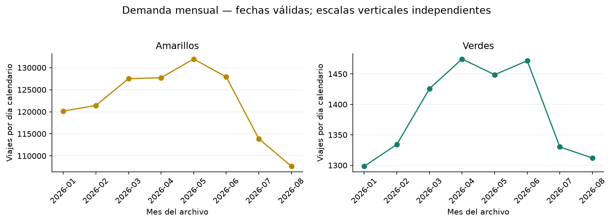
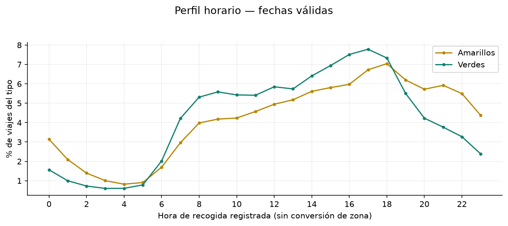
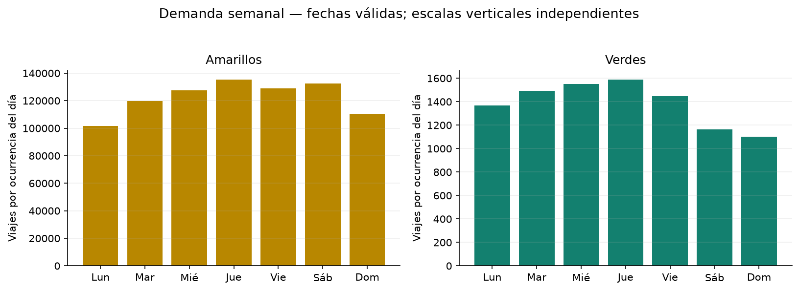
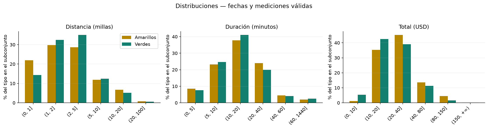
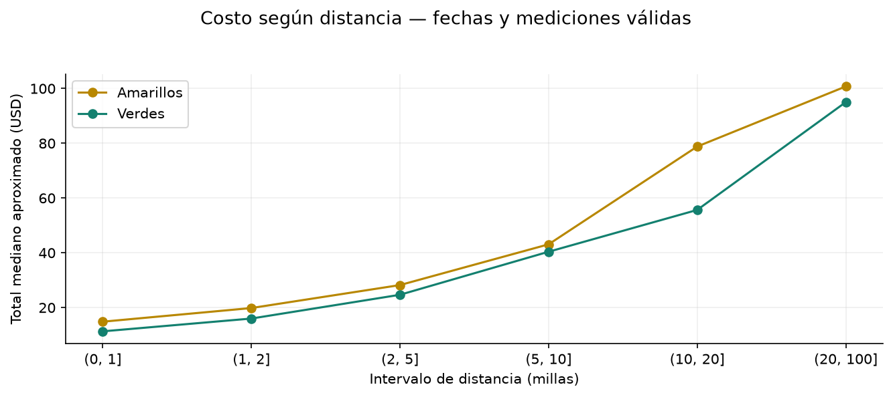
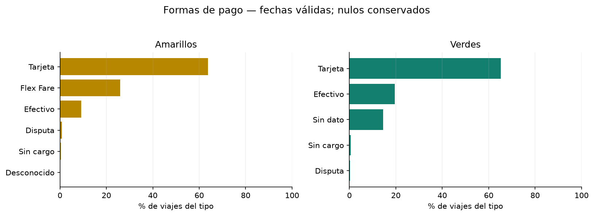
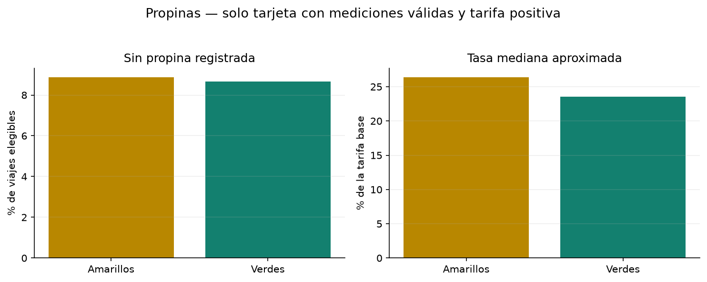

# Ejercicio 4: análisis exploratorio con DuckDB

Trabajo individual. Generado el 2026-10-07T01:41:29.664300+00:00 (UTC).

## Alcance y reproducción

Meses disponibles: 2026-01, 2026-02, 2026-03, 2026-04, 2026-05, 2026-06, 2026-07, 2026-08. Se analizan los archivos del inventario del ejercicio 3. Los meses no publicados no se representan como cero viajes y no se extrapola el año completo.

```bash
docker compose exec -T lab python scripts/analyze_trips.py
```

También puede ejecutar `notebooks/04_analisis_exploratorio.ipynb` completo en JupyterLab. Ambos métodos usan los SQL de `sql/eda/`, producen CSV en `docs/resultados_ejercicio_4/` y gráficos en `docs/figuras_ejercicio_4/`. Se sigue consultando Parquet mediante vistas en memoria; no se materializan los viajes ni se cargan completos en Pandas.

## Poblaciones y decisiones de calidad

1. **Original:** todas las filas descargadas. 2. **Fechas válidas:** la recogida pertenece al mes del nombre del archivo. Es la población de demanda, modalidades de pago e importes negativos. 3. **Mediciones válidas:** además, 0 < distancia <= 100 millas, 0 < duración <= 1440 minutos, total > 0 y tarifa base >= 0. Se utiliza para perfiles, distribuciones y costo por distancia. La tasa de propina agrega tarjeta, tarifa base positiva y propina no negativa.

Son filtros exploratorios, no límites oficiales ni correcciones de la fuente. Los Parquet permanecen intactos. No se excluyen filas por pasajeros nulos o pago nulo. La duración se calcula en segundos y se expresa en minutos; las marcas de tiempo se conservan sin convertir de zona horaria. Las alertas por criterio se solapan. La consulta 11 mide sensibilidad al conjunto de filtros, sin aislar causalmente cada criterio.

| tipo_taxi | registros_originales | fechas_validas | mediciones_validas | fecha_excluida | distancia_alerta | duracion_alerta | importe_alerta | porcentaje_mediciones_sobre_original |
| --- | --- | --- | --- | --- | --- | --- | --- | --- |
| green | 337114 | 337016.0 | 323668.0 | 98.0 | 12284.0 | 238.0 | 1568.0 | 96.0114 |
| yellow | 29703355 | 29703209.0 | 28240105.0 | 146.0 | 953454.0 | 371946.0 | 167228.0 | 95.0738 |

## Hallazgos respaldados por resultados (4.5)

1. **Demanda mensual, amarillos:** el máximo diario medio aparece en 2026-05, con 131,962.00 viajes/día; el mínimo en 2026-08, con 107,635.52. La diferencia máximo/mínimo es 22.60%. Se comparan promedios diarios, no meses de igual duración. Fuente: consulta 02; no demuestra estacionalidad recurrente con un solo tramo temporal.

2. **Patrón temporal, amarillos:** la hora con mayor proporción es 18:00–18:59 (7.04% del tipo); las horas 17–20 concentran 25.68%. Jueves presenta el mayor promedio semanal, 135,471.26 viajes por ocurrencia del día. Fuente: consultas 03–04; los calendarios están normalizados, pero no se controla por eventos o composición mensual.

3. **Demanda mensual, verdes:** el máximo diario medio aparece en 2026-04, con 1,474.50 viajes/día; el mínimo en 2026-01, con 1,298.39. La diferencia máximo/mínimo es 13.56%. Se comparan promedios diarios, no meses de igual duración. Fuente: consulta 02; no demuestra estacionalidad recurrente con un solo tramo temporal.

4. **Patrón temporal, verdes:** la hora con mayor proporción es 17:00–17:59 (7.78% del tipo); las horas 17–20 concentran 24.85%. Jueves presenta el mayor promedio semanal, 1,590.26 viajes por ocurrencia del día. Fuente: consultas 03–04; los calendarios están normalizados, pero no se controla por eventos o composición mensual.

5. **Diferencias en características:** las medianas aproximadas de distancia son 1.93 millas en amarillos y 2.14 en verdes; las duraciones medianas, 14.12 y 13.35 minutos; los totales medianos, USD 23.58 y USD 20.57. Fuente: consulta 05, solo mediciones válidas. No se igualan rutas, tarifas ni horarios, por lo que no se interpreta como diferencia causal de precio entre servicios.

6. **Concentración de distancias:** los viajes de hasta 5 millas representan amarillos: 80.44%; verdes: 81.83%. Fuente: consulta 06, subconjunto de mediciones válidas. La concentración en distancias cortas coexiste con una cola de viajes largos; estos porcentajes no incluyen distancia cero ni mediciones descartadas.

7. **Composición de pagos:** Amarillos: Tarjeta representa 63.77%, efectivo 9.12% y Flex Fare o Sin dato 25.98%; Verdes: Tarjeta representa 65.25%, efectivo 19.55% y Flex Fare o Sin dato 14.47%. Fuente: consulta 08, fechas válidas. Flex Fare y Sin dato son categorías distintas y sus porcentajes no se reasignan a tarjeta/efectivo.

8. **Propinas de tarjeta, verdes:** sobre 212,456 viajes elegibles, 8.66% tienen propina registrada cero; la mediana aproximada de propina/tarifa base es 23.57%. Fuente: consulta 09. No se generaliza a efectivo ni a todos los viajes; cero significa cero registrado, no prueba ausencia de otras propinas.

9. **Propinas de tarjeta, amarillos:** sobre 18,460,906 viajes elegibles, 8.88% tienen propina registrada cero; la mediana aproximada de propina/tarifa base es 26.41%. Fuente: consulta 09. No se generaliza a efectivo ni a todos los viajes; cero significa cero registrado, no prueba ausencia de otras propinas.

10. **Importes negativos, amarillos:** 100,854 negativos están en pago tipo 4 (Disputa), equivalentes a 62.32% de los negativos del tipo. Dentro de esa categoría, 42.11% son negativos. Fuente: consulta 10. Es una asociación con la categoría reportada, no evidencia de que todo negativo sea un reembolso o error.

11. **Importes negativos, verdes:** 279 negativos están en pago tipo 4 (Disputa), equivalentes a 27.30% de los negativos del tipo. Dentro de esa categoría, 37.20% son negativos. Fuente: consulta 10. Es una asociación con la categoría reportada, no evidencia de que todo negativo sea un reembolso o error.

12. **Sensibilidad, amarillos:** la distancia media pasa de 5.55 a 3.52 millas, conservando 95.07% de los viajes con fechas válidas. Fuente: consulta 11. Los filtros cambian a la vez distancia, duración e importes; la diferencia no se atribuye exclusivamente a distancias extremas.

13. **Sensibilidad, verdes:** la distancia media pasa de 13.35 a 3.36 millas, conservando 96.04% de los viajes con fechas válidas. Fuente: consulta 11. Los filtros cambian a la vez distancia, duración e importes; la diferencia no se atribuye exclusivamente a distancias extremas.

## Preguntas, SQL, resultados e interpretación (4.1–4.4)

### 01_cobertura: Cobertura y poblaciones

**Pregunta:** ¿Qué proporción de datos conserva cada población de análisis?

**Justificación:** Las alertas del ejercicio 3 requieren declarar denominadores y filtros antes de interpretar resultados.

**Población y fuente:** Todos los viajes originales. Archivos del [inventario](resultados_ejercicio_3/01_inventario.csv), mediante las vistas de [00_fuentes.sql](../sql/exploracion/00_fuentes.sql) y [00_poblaciones.sql](../sql/eda/00_poblaciones.sql).

**Consulta:** [01_cobertura.sql](../sql/eda/01_cobertura.sql). **Resultado completo:** [01_cobertura.csv](resultados_ejercicio_4/01_cobertura.csv), 2 filas de salida.

**Interpretación y límites:** Las causas de exclusión pueden solaparse y no se suman para obtener filas únicas.

| tipo_taxi | registros_originales | fechas_validas | mediciones_validas | fecha_excluida | distancia_alerta | duracion_alerta | importe_alerta |
| --- | --- | --- | --- | --- | --- | --- | --- |
| green | 337114 | 337016.0 | 323668.0 | 98.0 | 12284.0 | 238.0 | 1568.0 |
| yellow | 29703355 | 29703209.0 | 28240105.0 | 146.0 | 953454.0 | 371946.0 | 167228.0 |

### 02_demanda_mensual: Demanda mensual

**Pregunta:** ¿Cómo cambia el volumen mensual y el promedio diario de viajes?

**Justificación:** Los meses tienen distinta duración; comparar solo totales puede confundir calendario con demanda.

**Población y fuente:** Viajes con fechas coherentes con el archivo. Archivos del [inventario](resultados_ejercicio_3/01_inventario.csv), mediante las vistas de [00_fuentes.sql](../sql/exploracion/00_fuentes.sql) y [00_poblaciones.sql](../sql/eda/00_poblaciones.sql).

**Consulta:** [02_demanda_mensual.sql](../sql/eda/02_demanda_mensual.sql). **Resultado completo:** [02_demanda_mensual.csv](resultados_ejercicio_4/02_demanda_mensual.csv), 16 filas de salida.

**Interpretación y límites:** La comparación principal usa viajes por día calendario; se informa también cuántos días presentan viajes.

| tipo_taxi | mes_archivo | viajes | dias_calendario | dias_con_viajes | viajes_por_dia |
| --- | --- | --- | --- | --- | --- |
| green | 2026-01-01 00:00:00 | 40250 | 31 | 31 | 1298.39 |
| green | 2026-02-01 00:00:00 | 37362 | 28 | 28 | 1334.36 |
| green | 2026-03-01 00:00:00 | 44199 | 31 | 31 | 1425.77 |
| green | 2026-04-01 00:00:00 | 44235 | 30 | 30 | 1474.5 |
| green | 2026-05-01 00:00:00 | 44911 | 31 | 31 | 1448.74 |
| green | 2026-06-01 00:00:00 | 44150 | 30 | 30 | 1471.67 |
| green | 2026-07-01 00:00:00 | 41236 | 31 | 31 | 1330.19 |
| green | 2026-08-01 00:00:00 | 40673 | 31 | 31 | 1312.03 |
| yellow | 2026-01-01 00:00:00 | 3724882 | 31 | 31 | 120157.48 |
| yellow | 2026-02-01 00:00:00 | 3399850 | 28 | 28 | 121423.21 |
| yellow | 2026-03-01 00:00:00 | 3952432 | 31 | 31 | 127497.81 |
| yellow | 2026-04-01 00:00:00 | 3831228 | 30 | 30 | 127707.6 |
| yellow | 2026-05-01 00:00:00 | 4090822 | 31 | 31 | 131962.0 |
| yellow | 2026-06-01 00:00:00 | 3837231 | 30 | 30 | 127907.7 |
| yellow | 2026-07-01 00:00:00 | 3530063 | 31 | 31 | 113873.0 |
| yellow | 2026-08-01 00:00:00 | 3336701 | 31 | 31 | 107635.52 |



### 03_demanda_horaria: Demanda por hora

**Pregunta:** ¿A qué horas se concentran los viajes y difieren los perfiles entre taxis?

**Justificación:** Las marcas de recogida permiten detectar patrones de uso; los volúmenes de ambos tipos son muy distintos.

**Población y fuente:** Viajes con fechas coherentes con el archivo. Archivos del [inventario](resultados_ejercicio_3/01_inventario.csv), mediante las vistas de [00_fuentes.sql](../sql/exploracion/00_fuentes.sql) y [00_poblaciones.sql](../sql/eda/00_poblaciones.sql).

**Consulta:** [03_demanda_horaria.sql](../sql/eda/03_demanda_horaria.sql). **Resultado completo:** [03_demanda_horaria.csv](resultados_ejercicio_4/03_demanda_horaria.csv), 48 filas de salida.

**Interpretación y límites:** Se comparan porcentajes dentro de cada tipo, no conteos sobre una escala dominada por amarillos.



### 04_demanda_semanal: Demanda por día de semana

**Pregunta:** ¿Qué días de la semana presentan mayor demanda diaria promedio?

**Justificación:** Los días de semana no aparecen la misma cantidad de veces en el calendario disponible.

**Población y fuente:** Viajes con fechas coherentes con el archivo. Archivos del [inventario](resultados_ejercicio_3/01_inventario.csv), mediante las vistas de [00_fuentes.sql](../sql/exploracion/00_fuentes.sql) y [00_poblaciones.sql](../sql/eda/00_poblaciones.sql).

**Consulta:** [04_demanda_semanal.sql](../sql/eda/04_demanda_semanal.sql). **Resultado completo:** [04_demanda_semanal.csv](resultados_ejercicio_4/04_demanda_semanal.csv), 14 filas de salida.

**Interpretación y límites:** Cada conteo se divide por las ocurrencias de ese día en los meses descargados; los posibles días sin viajes cuentan como cero.

| tipo_taxi | dia_semana | dias_calendario | viajes | viajes_por_dia |
| --- | --- | --- | --- | --- |
| green | 1 | 35 | 47912 | 1368.9143 |
| green | 2 | 34 | 50794 | 1493.9412 |
| green | 3 | 34 | 52679 | 1549.3824 |
| green | 4 | 35 | 55659 | 1590.2571 |
| green | 5 | 35 | 50671 | 1447.7429 |
| green | 6 | 35 | 40764 | 1164.6857 |
| green | 7 | 35 | 38537 | 1101.0571 |
| yellow | 1 | 35 | 3552482 | 101499.4857 |
| yellow | 2 | 34 | 4066804 | 119611.8824 |
| yellow | 3 | 34 | 4339210 | 127623.8235 |
| yellow | 4 | 35 | 4741494 | 135471.2571 |
| yellow | 5 | 35 | 4509023 | 128829.2286 |
| yellow | 6 | 35 | 4633114 | 132374.6857 |
| yellow | 7 | 35 | 3861082 | 110316.6286 |



### 05_perfil_viajes: Características de los viajes

**Pregunta:** ¿Cómo difieren distancia, duración y total pagado entre amarillos y verdes?

**Justificación:** Los extremos observados en el ejercicio 3 aconsejan contrastar medias con medianas y percentiles.

**Población y fuente:** Viajes con fechas y mediciones válidas. Archivos del [inventario](resultados_ejercicio_3/01_inventario.csv), mediante las vistas de [00_fuentes.sql](../sql/exploracion/00_fuentes.sql) y [00_poblaciones.sql](../sql/eda/00_poblaciones.sql).

**Consulta:** [05_perfil_viajes.sql](../sql/eda/05_perfil_viajes.sql). **Resultado completo:** [05_perfil_viajes.csv](resultados_ejercicio_4/05_perfil_viajes.csv), 2 filas de salida.

**Interpretación y límites:** Los percentiles son aproximados; las diferencias describen este subconjunto y no prueban una causa.

| tipo_taxi | viajes | distancia_media_millas | distancia_mediana_millas | distancia_p95_millas | duracion_media_minutos | duracion_mediana_minutos | duracion_p95_minutos | total_medio_usd | total_mediano_usd | total_p95_usd |
| --- | --- | --- | --- | --- | --- | --- | --- | --- | --- | --- |
| green | 323668 | 3.3606 | 2.1444 | 10.6782 | 21.2428 | 13.3482 | 45.2137 | 25.5736 | 20.5726 | 57.0093 |
| yellow | 28240105 | 3.5176 | 1.9339 | 12.6948 | 17.949 | 14.1238 | 44.2064 | 30.2446 | 23.5785 | 77.4607 |

### 06_distribuciones: Distribuciones

**Pregunta:** ¿Predominan los viajes cortos y cómo se distribuyen duraciones y pagos?

**Justificación:** Una media no muestra la concentración ni la cola de la distribución.

**Población y fuente:** Viajes con fechas y mediciones válidas. Archivos del [inventario](resultados_ejercicio_3/01_inventario.csv), mediante las vistas de [00_fuentes.sql](../sql/exploracion/00_fuentes.sql) y [00_poblaciones.sql](../sql/eda/00_poblaciones.sql).

**Consulta:** [06_distribuciones.sql](../sql/eda/06_distribuciones.sql). **Resultado completo:** [06_distribuciones.csv](resultados_ejercicio_4/06_distribuciones.csv), 36 filas de salida.

**Interpretación y límites:** Los intervalos se fijan explícitamente y sus porcentajes usan el total de cada tipo y variable.



### 07_costo_distancia: Costo según distancia

**Pregunta:** ¿Cómo cambia el total mediano según el intervalo de distancia?

**Justificación:** Distancia y total pueden estar asociados, pero el total incluye conceptos adicionales a la tarifa base.

**Población y fuente:** Viajes con fechas y mediciones válidas. Archivos del [inventario](resultados_ejercicio_3/01_inventario.csv), mediante las vistas de [00_fuentes.sql](../sql/exploracion/00_fuentes.sql) y [00_poblaciones.sql](../sql/eda/00_poblaciones.sql).

**Consulta:** [07_costo_distancia.sql](../sql/eda/07_costo_distancia.sql). **Resultado completo:** [07_costo_distancia.csv](resultados_ejercicio_4/07_costo_distancia.csv), 12 filas de salida.

**Interpretación y límites:** No se interpreta como efecto causal ni como tarifa por milla; los intervalos largos pueden tener pocos viajes.

| tipo_taxi | orden | intervalo_millas | viajes | total_mediano_usd | duracion_mediana_minutos |
| --- | --- | --- | --- | --- | --- |
| green | 1 | (0, 1] | 46328 | 11.3279 | 5.2709 |
| green | 2 | (1, 2] | 104953 | 16.0005 | 9.8513 |
| green | 3 | (2, 5] | 113576 | 24.6828 | 16.483 |
| green | 4 | (5, 10] | 40157 | 40.3946 | 27.01 |
| green | 5 | (10, 20] | 16891 | 55.6604 | 43.5101 |
| green | 6 | (20, 100] | 1763 | 95.0333 | 64.1572 |
| yellow | 1 | (0, 1] | 6201646 | 14.8515 | 6.0197 |
| yellow | 2 | (1, 2] | 8420162 | 19.8356 | 10.9574 |
| yellow | 3 | (2, 5] | 8093288 | 28.2265 | 18.032 |
| yellow | 4 | (5, 10] | 3369353 | 43.0987 | 25.7926 |
| yellow | 5 | (10, 20] | 1916945 | 78.8077 | 41.4235 |
| yellow | 6 | (20, 100] | 238711 | 100.7602 | 53.3368 |



### 08_formas_pago: Formas de pago

**Pregunta:** ¿Qué modalidades de pago predominan y qué diferencias aparecen entre tipos?

**Justificación:** La exploración encontró Flex Fare y pagos nulos; eliminarlos alteraría la composición observada.

**Población y fuente:** Viajes con fechas coherentes con el archivo. Archivos del [inventario](resultados_ejercicio_3/01_inventario.csv), mediante las vistas de [00_fuentes.sql](../sql/exploracion/00_fuentes.sql) y [00_poblaciones.sql](../sql/eda/00_poblaciones.sql).

**Consulta:** [08_formas_pago.sql](../sql/eda/08_formas_pago.sql). **Resultado completo:** [08_formas_pago.csv](resultados_ejercicio_4/08_formas_pago.csv), 11 filas de salida.

**Interpretación y límites:** Se conservan Flex Fare y Sin dato. Una categoría ausente no equivale a efectivo ni a tarjeta.

| tipo_taxi | payment_type | forma_pago | viajes | porcentaje_tipo |
| --- | --- | --- | --- | --- |
| green | 1 | Tarjeta | 219903 | 65.25 |
| green | 2 | Efectivo | 65902 | 19.5546 |
| green | 3 | Sin cargo | 1686 | 0.5003 |
| green | 4 | Disputa | 750 | 0.2225 |
| green | <NA> | Sin dato | 48775 | 14.4726 |
| yellow | 0 | Flex Fare | 7716688 | 25.9793 |
| yellow | 1 | Tarjeta | 18940892 | 63.7672 |
| yellow | 2 | Efectivo | 2708007 | 9.1169 |
| yellow | 3 | Sin cargo | 98132 | 0.3304 |
| yellow | 4 | Disputa | 239488 | 0.8063 |
| yellow | 5 | Desconocido | 2 | 0.0 |



### 09_propinas_tarjeta: Propinas registradas en tarjeta

**Pregunta:** ¿Cómo difieren las propinas registradas en los viajes pagados con tarjeta?

**Justificación:** Los diccionarios TLC indican que las propinas en efectivo no se registran.

**Población y fuente:** Mediciones válidas, payment_type=1, fare_amount>0 y tip_amount>=0. Archivos del [inventario](resultados_ejercicio_3/01_inventario.csv), mediante las vistas de [00_fuentes.sql](../sql/exploracion/00_fuentes.sql) y [00_poblaciones.sql](../sql/eda/00_poblaciones.sql).

**Consulta:** [09_propinas_tarjeta.sql](../sql/eda/09_propinas_tarjeta.sql). **Resultado completo:** [09_propinas_tarjeta.csv](resultados_ejercicio_4/09_propinas_tarjeta.csv), 2 filas de salida.

**Interpretación y límites:** La tasa es propina/tarifa base por viaje. No representa todas las propinas ni se compara con efectivo.

| tipo_taxi | viajes_tarjeta_elegibles | viajes_sin_propina_registrada | porcentaje_sin_propina | propina_media_usd | propina_mediana_usd | tasa_media_porcentaje | tasa_mediana_porcentaje |
| --- | --- | --- | --- | --- | --- | --- | --- |
| green | 212456 | 18408.0 | 8.6644 | 3.8092 | 3.1094 | 22.9652 | 23.5667 |
| yellow | 18460906 | 1639752.0 | 8.8823 | 4.256 | 3.2787 | 25.0941 | 26.4111 |



### 10_importes_negativos: Importes negativos y pagos

**Pregunta:** ¿En qué formas de pago aparecen totales negativos y qué proporción representan?

**Justificación:** El signo negativo requiere contexto; los códigos de pago incluyen disputas y viajes sin cargo.

**Población y fuente:** Viajes con fechas coherentes con el archivo, incluidos los importes negativos. Archivos del [inventario](resultados_ejercicio_3/01_inventario.csv), mediante las vistas de [00_fuentes.sql](../sql/exploracion/00_fuentes.sql) y [00_poblaciones.sql](../sql/eda/00_poblaciones.sql).

**Consulta:** [10_importes_negativos.sql](../sql/eda/10_importes_negativos.sql). **Resultado completo:** [10_importes_negativos.csv](resultados_ejercicio_4/10_importes_negativos.csv), 11 filas de salida.

**Interpretación y límites:** Se informa la proporción negativa dentro de cada categoría sin atribuir automáticamente su causa.

| tipo_taxi | payment_type | viajes_categoria | totales_negativos | porcentaje_negativo_categoria |
| --- | --- | --- | --- | --- |
| green | 1 | 219903 | 137.0 | 0.0623 |
| green | 2 | 65902 | 43.0 | 0.0652 |
| green | 3 | 1686 | 563.0 | 33.3926 |
| green | 4 | 750 | 279.0 | 37.2 |
| green | <NA> | 48775 | 0.0 | 0.0 |
| yellow | 0 | 7716688 | 94.0 | 0.0012 |
| yellow | 1 | 18940892 | 3511.0 | 0.0185 |
| yellow | 2 | 2708007 | 39646.0 | 1.464 |
| yellow | 3 | 98132 | 17727.0 | 18.0644 |
| yellow | 4 | 239488 | 100854.0 | 42.1123 |
| yellow | 5 | 2 | 0.0 | 0.0 |

### 11_sensibilidad: Sensibilidad a los filtros

**Pregunta:** ¿Cuánto cambian las medias al aplicar los filtros de medición?

**Justificación:** El subconjunto filtrado cambia la cobertura y puede modificar las conclusiones.

**Población y fuente:** Comparación entre fechas válidas y fechas+mediciones válidas. Archivos del [inventario](resultados_ejercicio_3/01_inventario.csv), mediante las vistas de [00_fuentes.sql](../sql/exploracion/00_fuentes.sql) y [00_poblaciones.sql](../sql/eda/00_poblaciones.sql).

**Consulta:** [11_sensibilidad.sql](../sql/eda/11_sensibilidad.sql). **Resultado completo:** [11_sensibilidad.csv](resultados_ejercicio_4/11_sensibilidad.csv), 4 filas de salida.

**Interpretación y límites:** Cambian varios criterios simultáneamente; no se atribuye toda la diferencia a un único filtro.

| poblacion | tipo_taxi | viajes | distancia_media_millas | duracion_media_minutos | total_medio_usd |
| --- | --- | --- | --- | --- | --- |
| Fechas válidas, sin filtros de medición | green | 337016 | 13.3522 | 20.7693 | 25.4901 |
| Fechas y mediciones válidas | green | 323668 | 3.3606 | 21.2428 | 25.5736 |
| Fechas válidas, sin filtros de medición | yellow | 29703209 | 5.5529 | 17.6443 | 30.0697 |
| Fechas y mediciones válidas | yellow | 28240105 | 3.5176 | 17.949 | 30.2446 |

## Límites generales y fuentes

Las medianas y percentiles son aproximados. Los SQL sin ORDER BY antes de funciones aproximadas pueden presentar pequeñas diferencias entre ejecuciones por procesamiento paralelo. No se consideran inferencias causales, significancia estadística, ajuste por rutas ni corrección por inflación. El período observado no permite probar patrones anuales recurrentes. Se conservan los pagos ausentes y Flex Fare; no se atribuye significado a request_source sin un diccionario confirmado.

Los importes se expresan en USD y las distancias en millas. El total incluye más conceptos que la tarifa base. Los diccionarios TLC describen los códigos de pago y advierten que las propinas en efectivo no están incluidas; por eso la comparación de propinas se limita a tarjeta.

- [Diccionario TLC amarillo](https://www.nyc.gov/assets/tlc/downloads/pdf/data_dictionary_trip_records_yellow.pdf).

- [Diccionario TLC verde](https://www.nyc.gov/assets/tlc/downloads/pdf/data_dictionary_trip_records_green.pdf).

- [Catálogo TLC](https://www.nyc.gov/site/tlc/about/tlc-trip-record-data.page).

- [DuckDB: lectura de Parquet](https://duckdb.org/docs/stable/data/parquet/overview).

El análisis entrega más de tres hallazgos y cubre comportamiento temporal, características de viajes, diferencias entre taxis, pagos, distribuciones y atípicos. El tablero y la ampliación de años corresponden a ejercicios posteriores.
