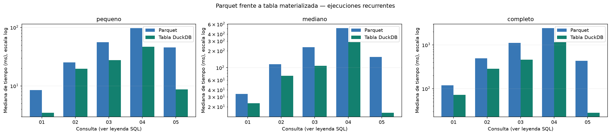
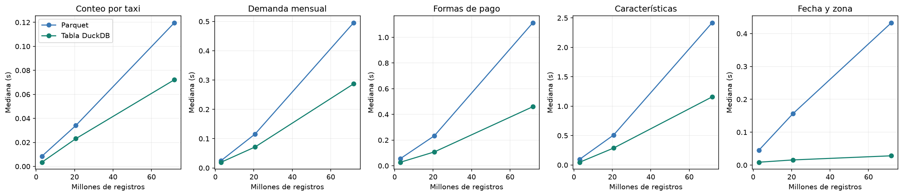

# Ejercicio 6: Parquet frente a tablas DuckDB

## Alcance y reproducción

El benchmark usa los tres conjuntos exactos de [preparacion_benchmark.json](preparacion_benchmark.json), con 2024 y 2026. No se infieren tiempos ni se extrapolan otros entornos.

```bash
docker compose exec -T lab python scripts/benchmark.py --repetitions 5 --warmups 1 --threads 4 --memory-limit 2GB --seed 42
```

Cada ejecución reconstruye las tres bases derivadas en `data/processed/benchmark/`. Para repetir solamente consultas sobre las mismas fuentes y tablas puede añadir `--reuse-materialized`; se verifican rutas, tamaños, fechas de modificación y SQL de origen. Los costos de construcción reutilizados pertenecen a su ejecución original, identificada en los metadatos locales. `--levels pequeno` permite una ejecución parcial. Para regenerar documentación/gráficos desde mediciones existentes utilice `--report-only`.

El notebook `06_benchmark_parquet_duckdb.ipynb` revisa las mediciones registradas; su opción RUN_BENCHMARK permite reproducirlas explícitamente. Todos los datos y bases permanecen excluidos de Git.

## 6.1–6.4: equivalencia y materialización

Para cada tamaño se crean vistas **temporales** de Parquet con listas explícitas de archivos, armonización de nombres y NULL estructurales. `CREATE TABLE viajes_duckdb AS SELECT * FROM viajes_parquet` materializa exactamente esa fuente sin limpiar, filtrar ni deduplicar. CHECKPOINT completa la persistencia. Se verifica el conteo contra el inventario del ejercicio 5 y se reabre la base con read_only antes de medir ambas estrategias. Solo la tabla persiste; las vistas externas no se guardan en la base, facilitando su uso posterior desde otra herramienta.

La tabla también guarda tipo de taxi, archivo y mes de archivo ya derivados. Parquet calcula esos campos mediante la vista. El SQL analítico solo cambia el nombre de la relación, pero parte del trabajo de armonización se paga al construir la tabla; esa ventaja tiene un costo explícito de materialización. No se crean índices ni se ordena la tabla deliberadamente.

Se comprobaron 15 combinaciones de tamaño/consulta. Los nombres y tipos de resultados coinciden. Cada ejecución medida también se compara con su referencia: categorías, fechas y conteos exactos; medias flotantes con tolerancias relativas 1e-9 y absolutas 1e-8 para diferencias de acumulación. No se utilizan percentiles aproximados en el benchmark.

## 6.5–6.7: protocolo y resultados

Condiciones registradas en [entorno.json](resultados_ejercicio_6/entorno.json):

```json
{
  "fecha_utc": "2026-10-07T18:37:11.554637+00:00",
  "duckdb": "1.5.5",
  "python": "3.11.14",
  "sistema": "Linux-6.5.11-linuxkit-aarch64-with-glibc2.41",
  "arquitectura": "aarch64",
  "cpus_visibles": 8,
  "cgroup_memory_max": "max",
  "cgroup_cpu_max": "max 100000",
  "threads": 4,
  "memory_limit": "2GB",
  "repeticiones": 5,
  "calentamientos": 1,
  "semilla": 42,
  "conexion_mediciones": "read_only, una por nivel y ambas estrategias",
  "caches": "un calentamiento mínimo; no se vacían cachés del SO; materialización previa lee los Parquet",
  "temporizador": "perf_counter; execute y fetchall; excluye comparación, CSV, EXPLAIN y materialización",
  "tolerancia": {
    "enteros_y_categorias": "exacta",
    "flotantes_rtol": 1e-09,
    "flotantes_atol": 1e-08
  },
  "orden": "consultas barajadas por ronda; estrategias alternadas por par; secuencial",
  "otros_servicios": "Jupyter, Metabase y otros contenedores pueden permanecer activos; no se aísla toda carga del host",
  "niveles_ejecutados": [
    "pequeno",
    "mediano",
    "completo"
  ],
  "materializacion_reutilizada": false
}
```

Se realiza al menos un calentamiento por estrategia/consulta, excluido de la tabla principal. Se intercalan consultas y alterna la estrategia que inicia cada par; la ejecución es secuencial. Las mediciones incluyen execute y fetchall, con resultados pequeños. Se excluyen materialización, verificación, exportación CSV y EXPLAIN. Son ejecuciones recurrentes con cachés no vaciadas, no un experimento de caché fría. El calentamiento no garantiza que todos los datos residan en RAM; no se mide pico de memoria y memory_limit no representa toda la memoria del proceso.

### Costo separado de materialización

| nivel | registros | cantidad_archivos | bytes_parquet | bytes_duckdb | preparacion_s | creacion_tabla_s | checkpoint_s | materializacion_s |
| --- | --- | --- | --- | --- | --- | --- | --- | --- |
| pequeno | 3021175 | 2 | 51323925 | 87568384 | 0.0356 | 5.688 | 0.1102 | 5.8338 |
| mediano | 20671900 | 12 | 350080949 | 589836288 | 0.039 | 10.3904 | 0.373 | 10.8024 |
| completo | 71870407 | 40 | 1228648745 | 2033201152 | 0.0343 | 38.6925 | 0.4756 | 39.2024 |

Materializacion_s incluye apertura/preparación de fuente, CTAS y checkpoint. La verificación posterior del conteo y el cierre no están incluidos. Los tamaños son bytes de Parquet y archivo DuckDB después del checkpoint; no incluyen scratch temporal.

### Comparación de medianas

| nivel | registros | consulta | duckdb_mediana_s | parquet_mediana_s | razon_parquet_duckdb | menor_mediana |
| --- | --- | --- | --- | --- | --- | --- |
| completo | 71870407 | 01_conteo | 0.072141 | 0.119634 | 1.658342 | duckdb |
| completo | 71870407 | 02_demanda_mensual | 0.286995 | 0.495517 | 1.726568 | duckdb |
| completo | 71870407 | 03_formas_pago | 0.459844 | 1.113174 | 2.420766 | duckdb |
| completo | 71870407 | 04_caracteristicas | 1.157525 | 2.418146 | 2.089065 | duckdb |
| completo | 71870407 | 05_filtro_fecha_zona | 0.028241 | 0.432831 | 15.326123 | duckdb |
| mediano | 20671900 | 01_conteo | 0.023123 | 0.034079 | 1.473835 | duckdb |
| mediano | 20671900 | 02_demanda_mensual | 0.071665 | 0.115961 | 1.618105 | duckdb |
| mediano | 20671900 | 03_formas_pago | 0.107938 | 0.233572 | 2.16395 | duckdb |
| mediano | 20671900 | 04_caracteristicas | 0.287754 | 0.509564 | 1.770832 | duckdb |
| mediano | 20671900 | 05_filtro_fecha_zona | 0.01569 | 0.156212 | 9.955889 | duckdb |
| pequeno | 3021175 | 01_conteo | 0.003489 | 0.008506 | 2.438053 | duckdb |
| pequeno | 3021175 | 02_demanda_mensual | 0.019594 | 0.025245 | 1.288385 | duckdb |
| pequeno | 3021175 | 03_formas_pago | 0.027734 | 0.055906 | 2.015814 | duckdb |
| pequeno | 3021175 | 04_caracteristicas | 0.046928 | 0.097158 | 2.070343 | duckdb |
| pequeno | 3021175 | 05_filtro_fecha_zona | 0.008734 | 0.045403 | 5.198349 | duckdb |

Razón = mediana Parquet / mediana DuckDB. Mayor que 1 favorece la tabla; menor que 1 favorece Parquet. `menor_mediana` identifica la menor observada, no significa una diferencia estadísticamente probada. La dispersión, mínimos y máximos están en [resumen.csv](resultados_ejercicio_6/resumen.csv), y todas las repeticiones en [tiempos.csv](resultados_ejercicio_6/tiempos.csv).





## 6.8: consultas del benchmark

### 01_conteo: Conteo por taxi

**Objetivo:** Inventario de registros; algunos conteos pueden aprovechar metadatos. **Origen:** Ejercicio 3: inventario.

**SQL:** [01_conteo.sql](../sql/benchmark/01_conteo.sql). Se sustituye únicamente {{fuente}} por viajes_parquet o viajes_duckdb. Los CSV por tamaño/estrategia están en resultados_ejercicio_6/resultados_consultas/ y los planes en resultados_ejercicio_6/planes/.

### 02_demanda_mensual: Demanda mensual

**Objetivo:** Agrupación temporal con el mismo criterio de fechas válidas del EDA. **Origen:** Ejercicio 4: demanda mensual.

**SQL:** [02_demanda_mensual.sql](../sql/benchmark/02_demanda_mensual.sql). Se sustituye únicamente {{fuente}} por viajes_parquet o viajes_duckdb. Los CSV por tamaño/estrategia están en resultados_ejercicio_6/resultados_consultas/ y los planes en resultados_ejercicio_6/planes/.

### 03_formas_pago: Formas de pago

**Objetivo:** Agrupación categórica y conteo condicional de importes negativos. **Origen:** Ejercicio 4: modalidades de pago e importes negativos.

**SQL:** [03_formas_pago.sql](../sql/benchmark/03_formas_pago.sql). Se sustituye únicamente {{fuente}} por viajes_parquet o viajes_duckdb. Los CSV por tamaño/estrategia están en resultados_ejercicio_6/resultados_consultas/ y los planes en resultados_ejercicio_6/planes/.

### 04_caracteristicas: Características

**Objetivo:** Filtros de calidad y medias de distancia, duración y total; evita percentiles aproximados para verificar equivalencia. **Origen:** Ejercicio 4: perfil de viajes y sensibilidad.

**SQL:** [04_caracteristicas.sql](../sql/benchmark/04_caracteristicas.sql). Se sustituye únicamente {{fuente}} por viajes_parquet o viajes_duckdb. Los CSV por tamaño/estrategia están en resultados_ejercicio_6/resultados_consultas/ y los planes en resultados_ejercicio_6/planes/.

### 05_filtro_fecha_zona: Fecha y zona

**Objetivo:** Filtro selectivo en una semana fija de enero de 2024, con agrupación por zona y tipo. **Origen:** Ejercicio 4: análisis temporal, distancia y pagos.

**SQL:** [05_filtro_fecha_zona.sql](../sql/benchmark/05_filtro_fecha_zona.sql). Se sustituye únicamente {{fuente}} por viajes_parquet o viajes_duckdb. Los CSV por tamaño/estrategia están en resultados_ejercicio_6/resultados_consultas/ y los planes en resultados_ejercicio_6/planes/.

## 6.9: interpretación de resultados

**pequeno:** la tabla tiene menor mediana en 5/5 consultas. La razón mayor es 5.20× en 05_filtro_fecha_zona; la menor, 1.29× en 02_demanda_mensual. Estos extremos se interpretan junto con los tiempos absolutos y la dispersión, especialmente en consultas de pocos milisegundos.

Una ronda que ejecuta una vez las cinco consultas tendría, sumando medianas observadas, un ahorro aproximado de 0.1257 s con la tabla. El costo de construcción de 5.83 s se compensaría alrededor de 47 rondas similares. Es una estimación bajo carga estable, no un umbral garantizado ni una medición de rondas completas; excluye mantenimiento, almacenamiento y cambios de datos.

**mediano:** la tabla tiene menor mediana en 5/5 consultas. La razón mayor es 9.96× en 05_filtro_fecha_zona; la menor, 1.47× en 01_conteo. Estos extremos se interpretan junto con los tiempos absolutos y la dispersión, especialmente en consultas de pocos milisegundos.

Una ronda que ejecuta una vez las cinco consultas tendría, sumando medianas observadas, un ahorro aproximado de 0.5432 s con la tabla. El costo de construcción de 10.80 s se compensaría alrededor de 20 rondas similares. Es una estimación bajo carga estable, no un umbral garantizado ni una medición de rondas completas; excluye mantenimiento, almacenamiento y cambios de datos.

**completo:** la tabla tiene menor mediana en 5/5 consultas. La razón mayor es 15.33× en 05_filtro_fecha_zona; la menor, 1.66× en 01_conteo. Estos extremos se interpretan junto con los tiempos absolutos y la dispersión, especialmente en consultas de pocos milisegundos.

Una ronda que ejecuta una vez las cinco consultas tendría, sumando medianas observadas, un ahorro aproximado de 2.5746 s con la tabla. El costo de construcción de 39.20 s se compensaría alrededor de 16 rondas similares. Es una estimación bajo carga estable, no un umbral garantizado ni una medición de rondas completas; excluye mantenimiento, almacenamiento y cambios de datos.

El crecimiento del conjunto se observa por consulta, no mediante una única tasa global. Los conteos, agregaciones con filtros y selección por fecha tienen trabajos distintos. Las diferencias pueden estar relacionadas con estadísticas, formato y compresión, descarte de grupos de filas, costo de abrir varios archivos, cachés y los campos derivados precomputados. Estas son explicaciones posibles apoyadas por capacidades de DuckDB; no se aísla causalmente cada factor. Los EXPLAIN guardados permiten revisar los operadores concretos sin añadir su ejecución al tiempo medido.

## 6.10: cuándo usar cada estrategia

**Parquet directo:** exploración o consultas ocasionales, archivos que llegan continuamente, necesidad de evitar una copia/materialización y flujos que ya organizan sus datos por archivos. Aprovecha que se pueden seleccionar columnas y aplicar filtros, pero el beneficio depende de consulta y organización.

**Tabla DuckDB:** consultas repetidas sobre una instantánea, necesidad de un archivo analítico persistente y casos donde el ahorro medido compensa construcción y mantenimiento. La tabla completa del laboratorio queda en `data/processed/benchmark/completo.duckdb`, con `viajes_duckdb`, lista para la conexión posterior del tablero en modo de solo lectura.

Esta medición no prueba que una estrategia sea siempre superior. El entorno usa Docker y volúmenes compartidos con macOS; otros servicios pueden competir por recursos. Los conjuntos también difieren en número de archivos, meses y esquemas, además de filas, por lo que la gráfica no aísla exclusivamente el tamaño. Para otra máquina o patrón de consultas se debe repetir el benchmark. No se cronometran conexiones nuevas por consulta ni se controla la caché del sistema operativo.

Referencias: [DuckDB: Parquet](https://duckdb.org/docs/current/data/parquet/overview) y [DuckDB: ajuste de cargas](https://duckdb.org/docs/current/guides/performance/how_to_tune_workloads).
