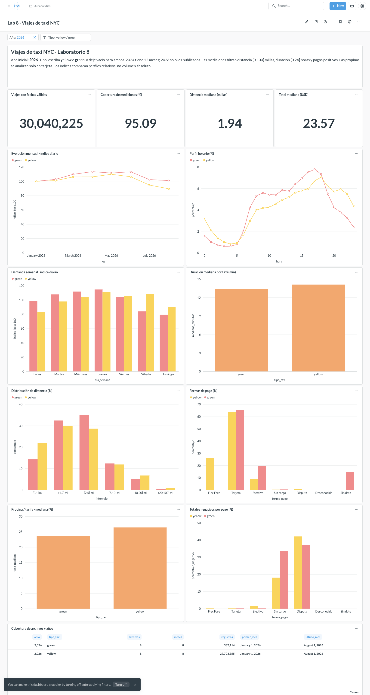
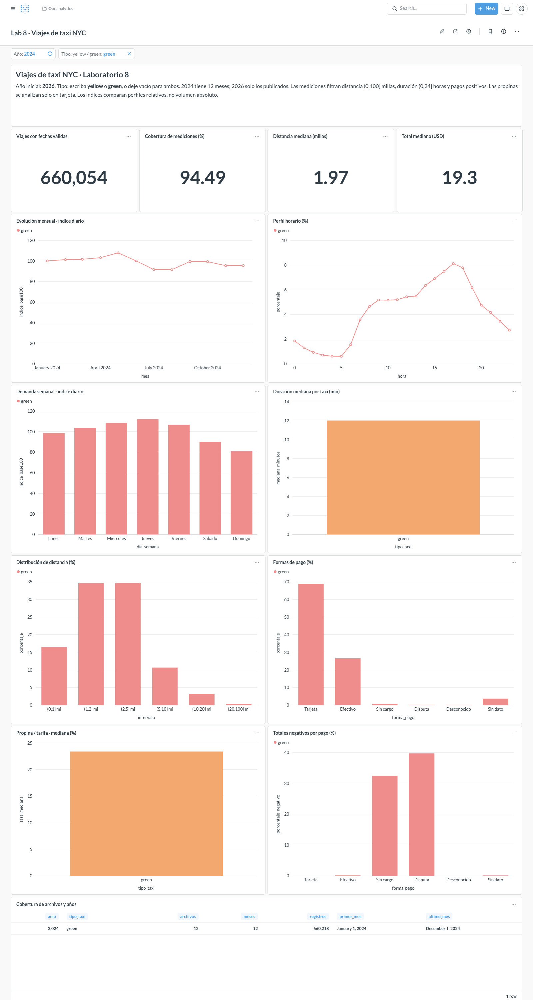

# Ejercicio 7: indicadores y tablero de viajes NYC

Trabajo individual. Resultados documentados para año 2026, tipo all.

## Preguntas y diseño (7.1–7.3)

Se definieron trece preguntas/indicadores, con SQL versionado y visualización en Metabase. La fuente es la tabla viajes_duckdb del archivo completo creado en el ejercicio 6 (2024 y 2026). El año corresponde al mes del archivo, no a fechas anómalas de recogida.

**Poblaciones:** original = todas las filas seleccionadas por año/tipo; temporal = recogida dentro del mes del archivo; mediciones = además distancia (0,100] millas, duración (0,1440] minutos, total positivo y tarifa no negativa. No se filtran pasajeros ni pagos nulos. Propinas = mediciones, tarjeta, tarifa positiva y propina no negativa. Estos umbrales son exploratorios, no normas oficiales.

**Filtros del tablero:** año (2026 inicial) y tipo (`yellow`/`green`, vacío para ambos). La cobertura ayuda a distinguir 2024 completo de 2026 parcial. Los índices mensual/semanal comparan perfiles relativos; no son conteos absolutos. Los CSV incluyen denominadores y valores absolutos para revisar su cálculo.

### 01_viajes: Viajes con fechas válidas

**Pregunta:** ¿Cuántos viajes hay en la selección?

**Justificación:** Cuantifica el volumen observado sin confundir los meses no publicados con cero viajes.

**Población:** temporal. **Unidad:** viajes.

**SQL:** [01_viajes.sql](../sql/indicadores/01_viajes.sql). **Resultado:** [CSV](resultados_ejercicio_7/duckdb/01_viajes.csv). **Visualización:** scalar.

| viajes |
| --- |
| 30040225 |

**Interpretación de la selección:** Se observan 30,040,225 viajes con fechas coherentes en la selección. Es volumen del período disponible, no una estimación anual.

### 02_retencion: Cobertura de mediciones (%)

**Pregunta:** ¿Qué porcentaje conserva el análisis de mediciones?

**Justificación:** Expone el efecto del filtrado y su denominador.

**Población:** temporal y mediciones. **Unidad:** %.

**SQL:** [02_retencion.sql](../sql/indicadores/02_retencion.sql). **Resultado:** [CSV](resultados_ejercicio_7/duckdb/02_retencion.csv). **Visualización:** scalar.

| porcentaje |
| --- |
| 95.085 |

**Interpretación de la selección:** El análisis de mediciones conserva 95.09% de la población temporal; 4.91% queda fuera de los criterios declarados. No implica que toda fila excluida sea un error.

### 03_distancia: Distancia mediana (millas)

**Pregunta:** ¿Cuál es la distancia típica?

**Justificación:** La mediana reduce la influencia de extremos; se declara la población filtrada.

**Población:** mediciones. **Unidad:** millas.

**SQL:** [03_distancia.sql](../sql/indicadores/03_distancia.sql). **Resultado:** [CSV](resultados_ejercicio_7/duckdb/03_distancia.csv). **Visualización:** scalar.

| mediana_millas |
| --- |
| 1.937 |

**Interpretación de la selección:** La distancia mediana aproximada es 1.94 millas; alrededor de la mitad de la población filtrada queda por debajo de ese valor.

### 04_total: Total mediano (USD)

**Pregunta:** ¿Cuánto se paga típicamente?

**Justificación:** El total incluye conceptos adicionales a la tarifa base; no equivale a precio por milla.

**Población:** mediciones. **Unidad:** USD.

**SQL:** [04_total.sql](../sql/indicadores/04_total.sql). **Resultado:** [CSV](resultados_ejercicio_7/duckdb/04_total.csv). **Visualización:** scalar.

| mediana_usd |
| --- |
| 23.556 |

**Interpretación de la selección:** El total mediano aproximado es USD 23.56. Describe el pago total de viajes filtrados, no el precio causal de elegir un tipo de taxi.

### 05_mensual: Evolución mensual · índice diario

**Pregunta:** ¿Cómo cambia la demanda diaria por mes y tipo?

**Justificación:** Normaliza los días de cada mes y muestra el cambio relativo para comparar tipos de distinto volumen.

**Población:** temporal. **Unidad:** índice: primer mes = 100.

**SQL:** [05_mensual.sql](../sql/indicadores/05_mensual.sql). **Resultado:** [CSV](resultados_ejercicio_7/duckdb/05_mensual.csv). **Visualización:** line.

| mes | tipo_taxi | viajes | viajes_por_dia | indice_base100 |
| --- | --- | --- | --- | --- |
| 2026-01-01 00:00:00 | green | 40250 | 1298.387 | 100.0 |
| 2026-01-01 00:00:00 | yellow | 3724882 | 120157.484 | 100.0 |
| 2026-02-01 00:00:00 | green | 37362 | 1334.357 | 102.77 |
| 2026-02-01 00:00:00 | yellow | 3399850 | 121423.214 | 101.053 |
| 2026-03-01 00:00:00 | green | 44199 | 1425.774 | 109.811 |
| 2026-03-01 00:00:00 | yellow | 3952432 | 127497.806 | 106.109 |
| 2026-04-01 00:00:00 | green | 44235 | 1474.5 | 113.564 |
| 2026-04-01 00:00:00 | yellow | 3831228 | 127707.6 | 106.284 |
| 2026-05-01 00:00:00 | green | 44911 | 1448.742 | 111.58 |
| 2026-05-01 00:00:00 | yellow | 4090822 | 131962.0 | 109.824 |
| 2026-06-01 00:00:00 | green | 44150 | 1471.667 | 113.346 |
| 2026-06-01 00:00:00 | yellow | 3837231 | 127907.7 | 106.45 |
| 2026-07-01 00:00:00 | green | 41236 | 1330.194 | 102.45 |
| 2026-07-01 00:00:00 | yellow | 3530063 | 113873.0 | 94.77 |
| 2026-08-01 00:00:00 | green | 40673 | 1312.032 | 101.051 |
| 2026-08-01 00:00:00 | yellow | 3336701 | 107635.516 | 89.579 |

**Interpretación de la selección:** green: el índice diario del último mes disponible es 101.05, frente a 100 del primer mes. Es una variación relativa dentro del tipo. yellow: el índice diario del último mes disponible es 89.58, frente a 100 del primer mes. Es una variación relativa dentro del tipo.

### 06_hora: Perfil horario (%)

**Pregunta:** ¿En qué horas se concentran los viajes?

**Justificación:** Usa proporciones dentro de cada tipo para que amarillos no oculten a verdes.

**Población:** temporal. **Unidad:** % dentro del tipo.

**SQL:** [06_hora.sql](../sql/indicadores/06_hora.sql). **Resultado:** [CSV](resultados_ejercicio_7/duckdb/06_hora.csv). **Visualización:** line.

| hora | tipo_taxi | viajes | porcentaje |
| --- | --- | --- | --- |
| 0 | green | 5287 | 1.569 |
| 0 | yellow | 933588 | 3.143 |
| 1 | green | 3370 | 1.0 |
| 1 | yellow | 621770 | 2.093 |
| 2 | green | 2459 | 0.73 |
| 2 | yellow | 415196 | 1.398 |
| 3 | green | 2041 | 0.606 |
| 3 | yellow | 298876 | 1.006 |
| 4 | green | 2057 | 0.61 |
| 4 | yellow | 245038 | 0.825 |
| 5 | green | 2655 | 0.788 |
| 5 | yellow | 269940 | 0.909 |
| 6 | green | 6811 | 2.021 |
| 6 | yellow | 504476 | 1.698 |
| 7 | green | 14213 | 4.217 |
| 7 | yellow | 879998 | 2.963 |
| 8 | green | 17911 | 5.315 |
| 8 | yellow | 1182588 | 3.981 |
| 9 | green | 18819 | 5.584 |
| 9 | yellow | 1241832 | 4.181 |
| 10 | green | 18294 | 5.428 |
| 10 | yellow | 1258682 | 4.238 |
| 11 | green | 18236 | 5.411 |
| 11 | yellow | 1358056 | 4.572 |
| 12 | green | 19707 | 5.847 |
| 12 | yellow | 1469373 | 4.947 |
| 13 | green | 19338 | 5.738 |
| 13 | yellow | 1537707 | 5.177 |
| 14 | green | 21600 | 6.409 |
| 14 | yellow | 1667289 | 5.613 |
| 15 | green | 23393 | 6.941 |
| 15 | yellow | 1724827 | 5.807 |
| 16 | green | 25326 | 7.515 |
| 16 | yellow | 1774368 | 5.974 |
| 17 | green | 26233 | 7.784 |
| 17 | yellow | 1997775 | 6.726 |
| 18 | green | 24712 | 7.333 |
| 18 | yellow | 2090996 | 7.04 |
| 19 | green | 18549 | 5.504 |
| 19 | yellow | 1840892 | 6.198 |
| 20 | green | 14251 | 4.229 |
| 20 | yellow | 1699253 | 5.721 |
| 21 | green | 12693 | 3.766 |
| 21 | yellow | 1759342 | 5.923 |
| 22 | green | 11026 | 3.272 |
| 22 | yellow | 1632677 | 5.497 |
| 23 | green | 8035 | 2.384 |
| 23 | yellow | 1298670 | 4.372 |

**Interpretación de la selección:** green: el máximo horario aparece a las 17:00–17:59, con 7.78% de los viajes del tipo. yellow: el máximo horario aparece a las 18:00–18:59, con 7.04% de los viajes del tipo.

### 07_semana: Demanda semanal · índice diario

**Pregunta:** ¿Qué días tienen más demanda promedio?

**Justificación:** Divide por las ocurrencias de cada día en los meses disponibles.

**Población:** temporal. **Unidad:** índice respecto al promedio diario.

**SQL:** [07_semana.sql](../sql/indicadores/07_semana.sql). **Resultado:** [CSV](resultados_ejercicio_7/duckdb/07_semana.csv). **Visualización:** bar.

| dia_semana | tipo_taxi | viajes_por_dia | indice_base100 |
| --- | --- | --- | --- |
| Lunes | green | 1368.914 | 98.703 |
| Lunes | yellow | 101499.486 | 83.036 |
| Martes | green | 1493.941 | 107.718 |
| Martes | yellow | 119611.882 | 97.854 |
| Miércoles | green | 1549.382 | 111.716 |
| Miércoles | yellow | 127623.824 | 104.408 |
| Jueves | green | 1590.257 | 114.663 |
| Jueves | yellow | 135471.257 | 110.828 |
| Viernes | green | 1447.743 | 104.387 |
| Viernes | yellow | 128829.229 | 105.394 |
| Sábado | green | 1164.686 | 83.978 |
| Sábado | yellow | 132374.686 | 108.295 |
| Domingo | green | 1101.057 | 79.39 |
| Domingo | yellow | 110316.629 | 90.249 |

**Interpretación de la selección:** green: Jueves tiene el mayor promedio diario, con índice 114.66. Se ajusta por cuántas veces aparece cada día en el calendario. yellow: Jueves tiene el mayor promedio diario, con índice 110.83. Se ajusta por cuántas veces aparece cada día en el calendario.

### 08_duracion: Duración mediana por taxi (min)

**Pregunta:** ¿Cómo difiere la duración típica entre tipos?

**Justificación:** Compara la misma población de mediciones y usa una unidad única.

**Población:** mediciones. **Unidad:** minutos.

**SQL:** [08_duracion.sql](../sql/indicadores/08_duracion.sql). **Resultado:** [CSV](resultados_ejercicio_7/duckdb/08_duracion.csv). **Visualización:** bar.

| tipo_taxi | viajes | mediana_minutos |
| --- | --- | --- |
| green | 323668 | 13.342 |
| yellow | 28240105 | 14.123 |

**Interpretación de la selección:** green: la duración mediana aproximada es 13.34 minutos. No se igualan rutas, horarios o tarifas entre tipos. yellow: la duración mediana aproximada es 14.12 minutos. No se igualan rutas, horarios o tarifas entre tipos.

### 09_distribucion: Distribución de distancia (%)

**Pregunta:** ¿Predominan los viajes cortos?

**Justificación:** Muestra la forma de la distribución en intervalos explícitos.

**Población:** mediciones. **Unidad:** % dentro del tipo.

**SQL:** [09_distribucion.sql](../sql/indicadores/09_distribucion.sql). **Resultado:** [CSV](resultados_ejercicio_7/duckdb/09_distribucion.csv). **Visualización:** bar.

| intervalo | tipo_taxi | viajes | porcentaje |
| --- | --- | --- | --- |
| (0,1] mi | green | 46328 | 14.313 |
| (0,1] mi | yellow | 6201646 | 21.96 |
| (1,2] mi | green | 104953 | 32.426 |
| (1,2] mi | yellow | 8420162 | 29.816 |
| (2,5] mi | green | 113576 | 35.09 |
| (2,5] mi | yellow | 8093288 | 28.659 |
| (5,10] mi | green | 40157 | 12.407 |
| (5,10] mi | yellow | 3369353 | 11.931 |
| (10,20] mi | green | 16891 | 5.219 |
| (10,20] mi | yellow | 1916945 | 6.788 |
| (20,100] mi | green | 1763 | 0.545 |
| (20,100] mi | yellow | 238711 | 0.845 |

**Interpretación de la selección:** green: 81.83% de los viajes de mediciones tienen hasta 5 millas. La proporción no incluye distancias cero o fuera del rango declarado. yellow: 80.44% de los viajes de mediciones tienen hasta 5 millas. La proporción no incluye distancias cero o fuera del rango declarado.

### 10_pago: Formas de pago (%)

**Pregunta:** ¿Qué modalidades de pago predominan?

**Justificación:** Conserva Flex Fare y los pagos sin dato sin reasignarlos a efectivo o tarjeta.

**Población:** temporal. **Unidad:** % dentro del tipo.

**SQL:** [10_pago.sql](../sql/indicadores/10_pago.sql). **Resultado:** [CSV](resultados_ejercicio_7/duckdb/10_pago.csv). **Visualización:** bar.

| forma_pago | tipo_taxi | viajes | porcentaje |
| --- | --- | --- | --- |
| Flex Fare | yellow | 7716688 | 25.979 |
| Tarjeta | green | 219903 | 65.25 |
| Tarjeta | yellow | 18940892 | 63.767 |
| Efectivo | green | 65902 | 19.555 |
| Efectivo | yellow | 2708007 | 9.117 |
| Sin cargo | green | 1686 | 0.5 |
| Sin cargo | yellow | 98132 | 0.33 |
| Disputa | green | 750 | 0.223 |
| Disputa | yellow | 239488 | 0.806 |
| Desconocido | yellow | 2 | 0.0 |
| Sin dato | green | 48775 | 14.473 |

**Interpretación de la selección:** green: Tarjeta es la categoría mayor (65.25%). Flex Fare y Sin dato se mantienen separados de tarjeta/efectivo. yellow: Tarjeta es la categoría mayor (63.77%). Flex Fare y Sin dato se mantienen separados de tarjeta/efectivo.

### 11_propinas: Propina / tarifa · mediana (%)

**Pregunta:** ¿Cómo difieren las propinas registradas en tarjeta?

**Justificación:** Las propinas en efectivo no se registran; el denominador es fare_amount, no el total.

**Población:** mediciones, tarjeta, tarifa positiva y propina no negativa. **Unidad:** % de tarifa base.

**SQL:** [11_propinas.sql](../sql/indicadores/11_propinas.sql). **Resultado:** [CSV](resultados_ejercicio_7/duckdb/11_propinas.csv). **Visualización:** bar.

| tipo_taxi | viajes_elegibles | porcentaje_sin_propina | tasa_mediana |
| --- | --- | --- | --- |
| green | 212456 | 8.664 | 23.58 |
| yellow | 18460906 | 8.882 | 26.412 |

**Interpretación de la selección:** green: mediana aproximada de propina/tarifa 23.58% sobre 212,456 viajes elegibles; 8.66% tienen propina registrada cero. No representa propinas en efectivo. yellow: mediana aproximada de propina/tarifa 26.41% sobre 18,460,906 viajes elegibles; 8.88% tienen propina registrada cero. No representa propinas en efectivo.

### 12_negativos: Totales negativos por pago (%)

**Pregunta:** ¿Dónde aparecen importes negativos?

**Justificación:** Mantiene las anomalías y sus denominadores; no atribuye automáticamente causas.

**Población:** temporal. **Unidad:** % negativo en categoría.

**SQL:** [12_negativos.sql](../sql/indicadores/12_negativos.sql). **Resultado:** [CSV](resultados_ejercicio_7/duckdb/12_negativos.csv). **Visualización:** bar.

| forma_pago | tipo_taxi | viajes_categoria | negativos | porcentaje_negativo |
| --- | --- | --- | --- | --- |
| Flex Fare | yellow | 7716688 | 94.0 | 0.001 |
| Tarjeta | green | 219903 | 137.0 | 0.062 |
| Tarjeta | yellow | 18940892 | 3511.0 | 0.019 |
| Efectivo | green | 65902 | 43.0 | 0.065 |
| Efectivo | yellow | 2708007 | 39646.0 | 1.464 |
| Sin cargo | green | 1686 | 563.0 | 33.393 |
| Sin cargo | yellow | 98132 | 17727.0 | 18.064 |
| Disputa | green | 750 | 279.0 | 37.2 |
| Disputa | yellow | 239488 | 100854.0 | 42.112 |
| Desconocido | yellow | 2 | 0.0 | 0.0 |
| Sin dato | green | 48775 | 0.0 | 0.0 |

**Interpretación de la selección:** green: 37.20% de los registros reportados como Disputa tienen total negativo. No se atribuye una causa a todo importe negativo. yellow: 42.11% de los registros reportados como Disputa tienen total negativo. No se atribuye una causa a todo importe negativo.

### 13_cobertura: Cobertura de archivos y años

**Pregunta:** ¿Qué meses y años respaldan la selección?

**Justificación:** Evita comparar un año completo con otro parcial.

**Población:** original. **Unidad:** archivos y registros.

**SQL:** [13_cobertura.sql](../sql/indicadores/13_cobertura.sql). **Resultado:** [CSV](resultados_ejercicio_7/duckdb/13_cobertura.csv). **Visualización:** table.

| anio | tipo_taxi | archivos | meses | registros | primer_mes | ultimo_mes |
| --- | --- | --- | --- | --- | --- | --- |
| 2026 | green | 8 | 8 | 337114 | 2026-01-01 00:00:00 | 2026-08-01 00:00:00 |
| 2026 | yellow | 8 | 8 | 29703355 | 2026-01-01 00:00:00 | 2026-08-01 00:00:00 |

**Interpretación de la selección:** green, 2026: 8 meses y 337,114 registros originales. Estos conteos incluyen fechas anómalas y pueden diferir del volumen temporal. yellow, 2026: 8 meses y 29,703,355 registros originales. Estos conteos incluyen fechas anómalas y pueden diferir del volumen temporal.

## Interpretación y hallazgos (7.6–7.8)

- yellow: la mayor proporción horaria aparece a las 18:00–18:59 (7.04% del tipo).
- yellow: efectivo representa 9.12% de los viajes temporales seleccionados; Sin dato y Flex Fare se conservan por separado.
- green: la mayor proporción horaria aparece a las 17:00–17:59 (7.78% del tipo).
- green: efectivo representa 19.55% de los viajes temporales seleccionados; Sin dato y Flex Fare se conservan por separado.

Las medianas son aproximadas. Los importes negativos se muestran según la categoría reportada, sin asumir reembolso o error. Cero de propina significa cero registrado; no se generaliza a efectivo. El total incluye conceptos distintos de la tarifa base. Comparaciones entre años deben usar los mismos meses o declarar la cobertura; los datos disponibles no permiten extrapolar el año completo ni demostrar causalidad.

## Tablero y reproducción (7.4–7.5)

Los indicadores se organizan en tarjetas resumen, demanda temporal, características/pagos, propinas/alertas y cobertura. La configuración versionada está en [indicadores.json](tablero/indicadores.json).

```bash
docker compose exec -T lab python scripts/build_indicators.py
```

Tras configurar Metabase, inicie sesión desde Terminal con `python scripts/metabase_dashboard.py --login`. La contraseña no se guarda; el token local se almacena en data/processed/, excluido de Git. Ejecute luego `python scripts/metabase_dashboard.py` para conectar la base en read_only, crear/actualizar las tarjetas, ejecutar sus consultas y montar el tablero.

La instalación es repetible: guarda IDs locales para actualizar el mismo tablero. docs/tablero/metabase_evidencia.json registra el enlace y los IDs cuando termina; los resultados de Metabase se guardan aparte para verificar su procedencia. Hasta que exista esa evidencia no se da por terminado el tablero.

Fuentes de interpretación: [diccionario amarillo TLC](https://www.nyc.gov/assets/tlc/downloads/pdf/data_dictionary_trip_records_yellow.pdf) y [diccionario verde TLC](https://www.nyc.gov/assets/tlc/downloads/pdf/data_dictionary_trip_records_green.pdf): distancia en millas, categorías de pago y exclusión de propinas en efectivo.

## Evidencia del tablero instalado

[Abrir tablero Metabase](http://localhost:3000/dashboard/2). 13 tarjetas verificadas con consultas ejecutadas en Metabase; conexión DuckDB read_only.





Las capturas corresponden a visualizaciones reales de Metabase. Los JSON de resultados están en resultados_ejercicio_7/metabase/; las medianas aproximadas pueden variar ligeramente respecto a los valores de referencia calculados por Python.
