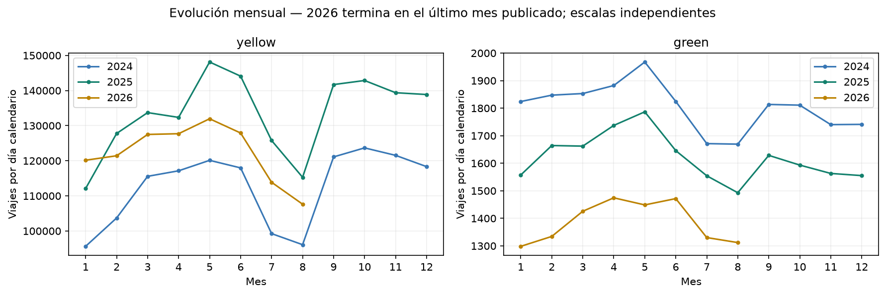
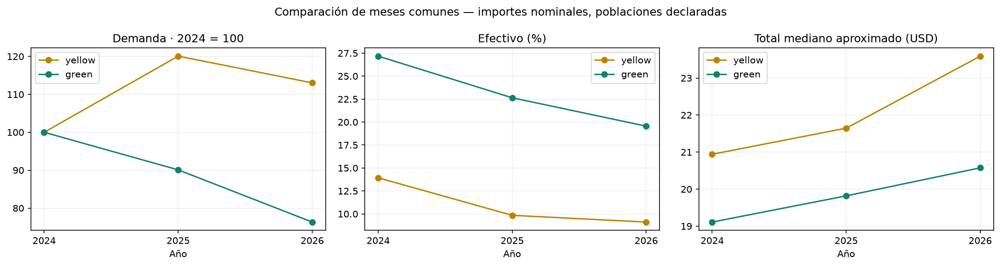
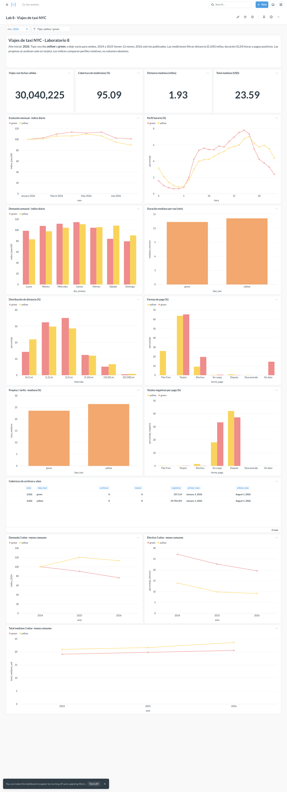
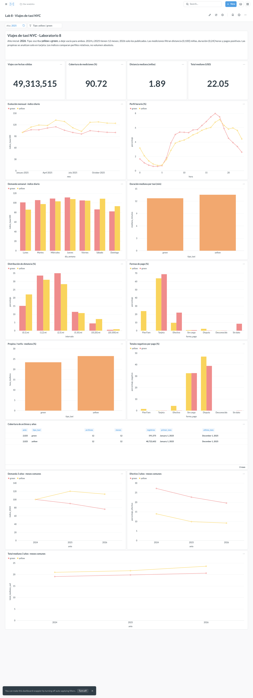

# Ejercicio 8: incorporación de 2025 y análisis de tres años

## Descarga y preservación (8.1–8.2)

Conjunto validado: 64 Parquet, 121,184,384 registros. Se preservaron 40 archivos anteriores en bytes, mtime y SHA-256.

```bash
docker compose exec -T lab python scripts/complete_three_years.py --snapshot
docker compose exec -T lab python scripts/download_data.py --years 2024 2025 2026 --verify-availability --manifest data/processed/download_manifest_2024_2025_2026_inicial.json
docker compose exec -T lab python scripts/download_data.py --years 2024 2025 2026 --verify-availability
docker compose exec -T lab python scripts/validate_download.py --manifest data/processed/download_manifest_2024_2025_2026.json --require-full-years 2024 2025
docker compose exec -T lab python scripts/complete_three_years.py
```

El snapshot debe crearse antes de ampliar y se conserva si existe. Los manifiestos inicial y repetido registran archivos descargados/omitidos; los datos y snapshots locales no se incluyen en Git.

## Cobertura y compatibilidad (8.3)

| anio | tipo_taxi | archivos | meses | registros |
| --- | --- | --- | --- | --- |
| 2024 | green | 12 | 12 | 660218 |
| 2024 | yellow | 12 | 12 | 41169720 |
| 2025 | green | 12 | 12 | 591375 |
| 2025 | yellow | 12 | 12 | 48722602 |
| 2026 | green | 8 | 8 | 337114 |
| 2026 | yellow | 8 | 8 | 29703355 |

Se ejecutaron 74 verificaciones de SQL/selección: EDA, consultas representativas del benchmark e indicadores en cada año. Los CSV están en resultados_ejercicio_8/ y no sustituyen los resultados históricos de los ejercicios anteriores.

## Indicadores y tablero (8.4)

La nueva instantánea inmutable de tres años contiene la misma tabla viajes_duckdb. docs/tablero/indicadores.json selecciona su ruta; scripts/metabase_dashboard.py actualiza la conexión sin duplicar tablero o tarjetas. La instantánea y los tiempos originales del benchmark se conservan. Para actualizar Metabase, utilice la sesión local existente y ejecute el instalador de nuevo; se conecta siempre en read_only.

## Evolución comparable (8.5)

La comparación utiliza solo meses presentes en todos los años y ambos tipos. La demanda incluye recogidas coherentes con su mes; perfiles/costos agregan los filtros de medición del ejercicio 4. Se normaliza por días calendario, no se comparan los totales de 12 meses con un año parcial. La consulta 03 declara la selección y denominadores.

| anio | tipo_taxi | viajes | porcentaje_tarjeta | porcentaje_efectivo | porcentaje_pasajeros_nulos | porcentaje_totales_negativos | dias | viajes_por_dia | viajes_mediciones | distancia_mediana | duracion_mediana | total_mediano_usd |
| --- | --- | --- | --- | --- | --- | --- | --- | --- | --- | --- | --- | --- |
| 2024 | green | 443325 | 67.9271 | 27.1765 | 3.9276 | 0.3481 | 244.0 | 1816.9057 | 418618 | 1.9595 | 11.8796 | 19.1106 |
| 2025 | green | 397771 | 69.4148 | 22.6429 | 7.0508 | 0.3062 | 243.0 | 1636.9177 | 376633 | 2.0283 | 12.4058 | 19.8177 |
| 2026 | green | 337016 | 65.25 | 19.5546 | 14.4726 | 0.3032 | 243.0 | 1386.8971 | 323668 | 2.1463 | 13.3473 | 20.5747 |
| 2024 | yellow | 26387932 | 74.0525 | 13.9343 | 9.5257 | 1.3671 | 244.0 | 108147.2623 | 25514075 | 1.7969 | 12.7059 | 20.9426 |
| 2025 | yellow | 31556277 | 63.8078 | 9.8498 | 23.2714 | 1.9353 | 243.0 | 129861.2222 | 28697626 | 1.8732 | 12.9927 | 21.646 |
| 2026 | yellow | 29703209 | 63.7672 | 9.1169 | 25.9793 | 0.5448 | 243.0 | 122235.428 | 28240105 | 1.9342 | 14.1162 | 23.5917 |





## Cambios y patrones (8.6)

1. **Demanda yellow:** viajes diarios del período común: 2024: 108,147.26, 2025: 129,861.22, 2026: 122,235.43. El cambio 2024→2026 es +13.03%. Se ajustan días calendario, incluido febrero bisiesto de 2024.

2. **Pago en efectivo yellow:** 13.93% en 2024, 9.85% en 2025 y 9.12% en 2026; cambio de -4.82 puntos porcentuales. No se reasignan pagos ausentes o Flex Fare.

3. **Cobertura de pasajeros yellow:** nulos 9.53% → 23.27% → 25.98%. Un cambio puede reflejar composición o registro; no prueba que haya viajes sin pasajeros.

4. **Total mediano yellow:** USD 20.94 → 21.65 → 23.59, en mediciones válidas. Es importe nominal, sin ajuste por inflación, rutas o cambios de cargos; no se atribuye causalidad.

5. **Demanda green:** viajes diarios del período común: 2024: 1,816.91, 2025: 1,636.92, 2026: 1,386.90. El cambio 2024→2026 es -23.67%. Se ajustan días calendario, incluido febrero bisiesto de 2024.

6. **Pago en efectivo green:** 27.18% en 2024, 22.64% en 2025 y 19.55% en 2026; cambio de -7.62 puntos porcentuales. No se reasignan pagos ausentes o Flex Fare.

7. **Cobertura de pasajeros green:** nulos 3.93% → 7.05% → 14.47%. Un cambio puede reflejar composición o registro; no prueba que haya viajes sin pasajeros.

8. **Total mediano green:** USD 19.11 → 19.82 → 20.57, en mediciones válidas. Es importe nominal, sin ajuste por inflación, rutas o cambios de cargos; no se atribuye causalidad.

Las variaciones de medianas son aproximadas. Los datos observados no identifican causalidad; composición de viajes, cobertura y registro pueden variar. Los importes no están ajustados por inflación y los meses de 2026 todavía no publicados no se tratan como cero.

## Consultas documentadas (8.7)

[01_cobertura.sql](../sql/evolucion/01_cobertura.sql): [resultado](resultados_ejercicio_8/01_cobertura.csv). Fuente: instantánea de los Parquet validados; año y mes proceden del archivo. 01 describe cobertura; 02 evolución mensual; 03 comparación en meses comunes; 04 perfil horario por año.

[02_evolucion_mensual.sql](../sql/evolucion/02_evolucion_mensual.sql): [resultado](resultados_ejercicio_8/02_evolucion_mensual.csv). Fuente: instantánea de los Parquet validados; año y mes proceden del archivo. 01 describe cobertura; 02 evolución mensual; 03 comparación en meses comunes; 04 perfil horario por año.

[03_periodo_comun.sql](../sql/evolucion/03_periodo_comun.sql): [resultado](resultados_ejercicio_8/03_periodo_comun.csv). Fuente: instantánea de los Parquet validados; año y mes proceden del archivo. 01 describe cobertura; 02 evolución mensual; 03 comparación en meses comunes; 04 perfil horario por año.

[04_horas_por_anio.sql](../sql/evolucion/04_horas_por_anio.sql): [resultado](resultados_ejercicio_8/04_horas_por_anio.csv). Fuente: instantánea de los Parquet validados; año y mes proceden del archivo. 01 describe cobertura; 02 evolución mensual; 03 comparación en meses comunes; 04 perfil horario por año.


## Verificación del tablero actualizado

El tablero conserva su URL: [Metabase](http://localhost:3000/dashboard/2).
Ahora tiene 16 tarjetas: las 13 anteriores y tres comparativas en meses comunes.
Las tres comparativas ignoran el filtro de año y sí aceptan el tipo de taxi.
La conexión apunta a la instantánea validada de tres años y permanece en read_only.

Se contrastaron las 16 respuestas de Metabase con las referencias DuckDB para
conteos, categorías y proporciones; las medianas son aproximadas. El filtro
2025 devolvió 49.313.515 viajes temporales, exactamente el conteo de referencia.
Véanse resultados_ejercicio_8/comprobacion_metabase.json y filtro_2025.json.




